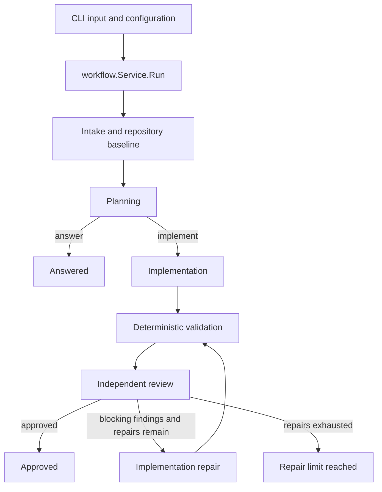

# Architecture and reading order

Multiharness is one Go application with one synchronous use case:
`workflow.Service.Run(ctx, input)`. Modules are ordinary packages with explicit
dependencies. There is no workflow engine, state registry, mediator, message bus
or dynamic strategy registry.

Read these files in order:

1. `internal/workflow/service.go`: task intake, planning/answer branch, initial
   implementation, then validation/review/repair until approval or exhaustion.
2. The relevant `internal/workflow/*_stage.go`: one function per stage, owning
   its request, execution, evidence checks and result validation.
3. `internal/store/plan.go`, `implementation.go`, `review.go`, and `result.go`:
   the data crossing stage boundaries and the invariants it must satisfy.
4. `cmd/multiharness/agents.go`: which provider serves each role, including
   the selected planning harness and the separately consented billing alternate.
5. The selected provider's adapter: prompt/schema encoding, command execution
   and strict response decoding.

The `schemaexec` planner/reviewer and `sessionexec` implementer call the shared
`structured` package directly. Prompts, schemas and parsers have one owner;
execution adapters do not repeat them through forwarding files or cached schema
variables. Shared parsing tests live with that implementation. Process directory
checks live beside process execution; shared contract-validation helpers live
with contract errors.

The `schemaexec` adapter has six source files: `planner.go`, `reviewer.go` and
`implementer.go` own the three roles; `config.go` owns settings and configuration
errors; `executor.go` owns CLI arguments, temporary response files and execution
errors; `runtime.go` owns installed-CLI discovery and compatibility selection.
Five test files cover these behaviors, with shared fixtures in `executor_test.go`.
All calls through this adapter are ephemeral.

The `sessionexec` adapter has five source files: `implementer.go` owns coding and
repair requests; `readonly.go` owns planning/review and their read-only policy;
`executor.go` owns commands and execution errors; `config.go` owns settings;
`parser.go` owns JSONL events, session validation and final responses. Five test
files retain role, execution, parsing and context-handoff checks.
Live activity has one owner, `activity.Runner`; the session parser only tracks
session identity, final responses and failure state.

These names describe execution protocols, not fixed workflow roles. `schemaexec`
currently speaks the Codex CLI protocol and `sessionexec` the OpenCode CLI
protocol. Their executable names, settings and wire formats remain compatible;
renaming packages does not add support for arbitrary CLI or API protocols.

Every stage can also stop with an explicit failure or cancellation. Reaching a
limit never becomes approval. The workflow records independent repository and
validation evidence; agent summaries cannot replace those checks.
`Workspace.Acquire` performs readiness checks and captures the baseline under
the lease. The workflow checks freshness again before implementation, and checks
cancellation after the final stage and lease cleanup before selecting an outcome.

| Module | Responsibility | Boundary |
| --- | --- | --- |
| `cmd/multiharness` | Startup and composition of concrete roles | Creates the service; never executes workflow stages itself |
| `internal/transport/cli` | Decode input, run once, present progress and final JSON | Calls `Service.Run`; does not choose or construct providers |
| `internal/config` | Defaults, precedence, section validation and path resolution | Provider settings stay outside workflow contracts |
| `internal/workflow` | Stage order, review/repair policy, retries, consent and evidence integrity | Depends only on store contracts and consumer-owned ports |
| `internal/store` | Serializable contracts and pure invariants | Does not depend on workflow, providers, filesystems or transport |
| `internal/adapter/agent` | Codex/OpenCode protocols, shared strict decoding and safe provider diagnostics | Implements planner/implementer/reviewer ports |
| `internal/adapter/workspace/git` | Checkout lease, baseline, independent change attribution | Implements workspace access; never decides approval |
| `internal/adapter/validation` | Deterministic command checks | Returns check evidence, including failed checks |
| `internal/adapter/process` and `setup` | OS execution and optional consented dependency installation | No task-routing or review policy |

The retained interfaces represent existing boundaries: agents, workspace access,
validation, events, consent and retry timing. There are no interfaces between
individual workflow stages. Adding a provider means implementing the relevant
role port and composing it at startup; ordinary role-specific behavior remains
in concrete functions.

`run_state.go` owns data for one invocation, stage-entry cancellation checks and
lease release. `agent_execution.go` owns launch accounting and delegates bounded
retry eligibility/waiting to one function. `billing_fallback.go` owns consent and
sticky role switches. `repository_evidence.go` owns integrity checks. These are
shared policies with different reasons to change, not interchangeable stages.

Error guards remain explicit because invalid output, stale evidence, failed
validation and cancellation have different meanings. Removing those guards
would change the product's behavior. The cleanup removes duplicate control flow
and unused indirection while retaining those distinctions.

Regression checks exercise the public service and production CLI composition,
including the repair loop, answer-only routing, cancellation at handoffs,
session boundaries, billing consent and preservation of existing user changes.
`internal/architecture/boundaries_test.go` also checks the production import
graph for core, adapter and transport dependency violations.
